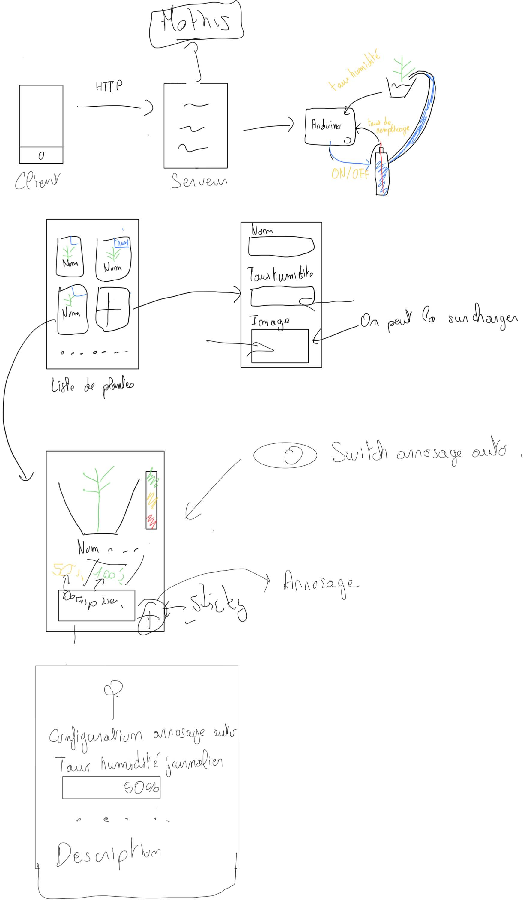
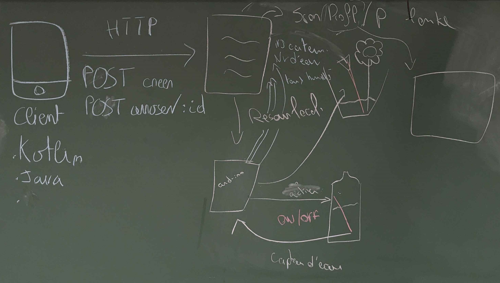

# Introduction

Ce projet a pour but de développer un système d'arrosage automatique. Le but est simple : pouvoir réaliser un suivi des plantes rapidement depuis un site Web.
Les fonctionnalités majeures de ce projet et ce que devra réaliser notre application sera : 

- Consulter la liste des plantes de notre domicile
- Consulter le détail d'une plante
- Arroser ses plantes automatiquement
  - en fonction du taux d'humidité
  - en puisant dans une source d'eau
- Arroser ses plantes manuellement 
  - depuis l'interface, sur chaque plante

Pour tout ce qui est arrosage, il y a une vérification du taux de remplissage de la source d'eau pour voir si elle est suffisante

# Conception

Durant la première séance, on a réalisé un brainstorming initial :

La maquette et quelques interactions avec le client

Schéma d'interaction client-serveur

