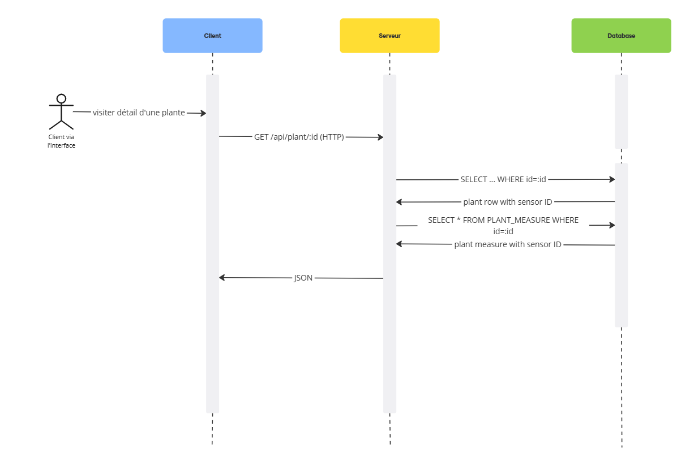
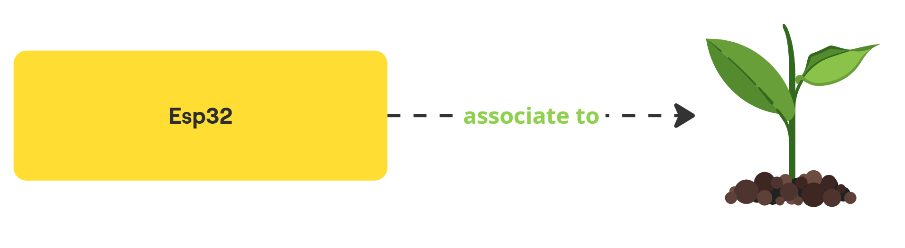
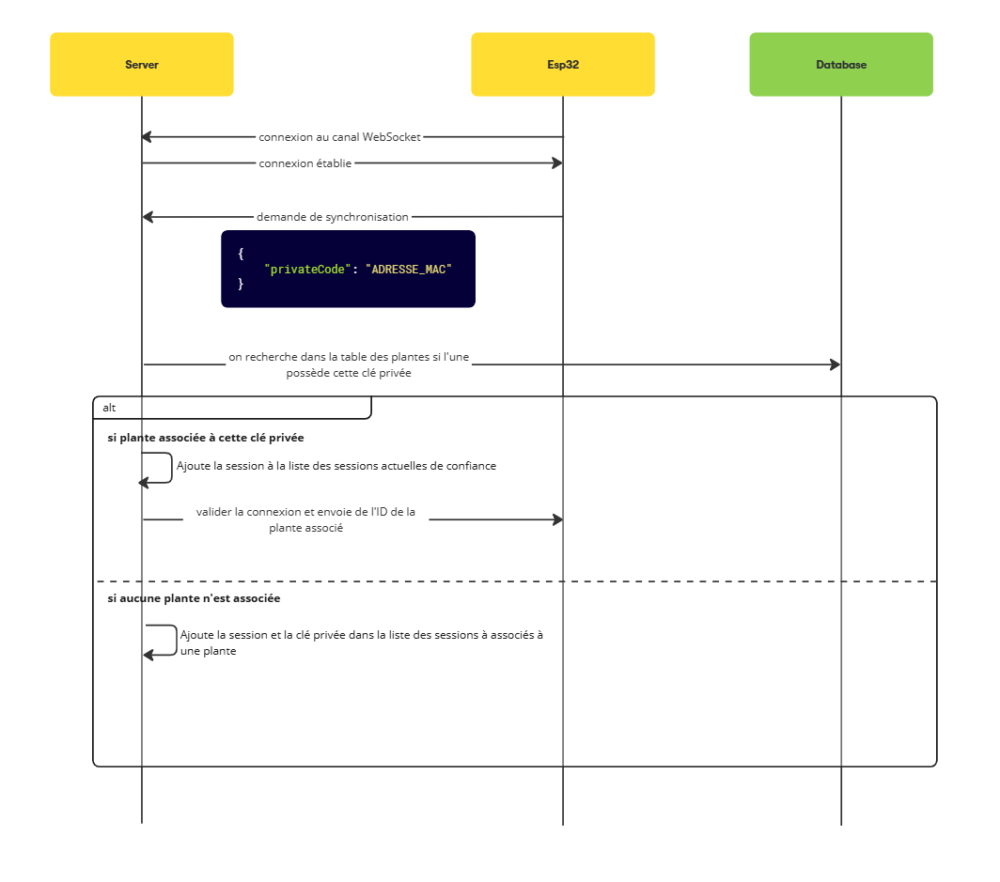
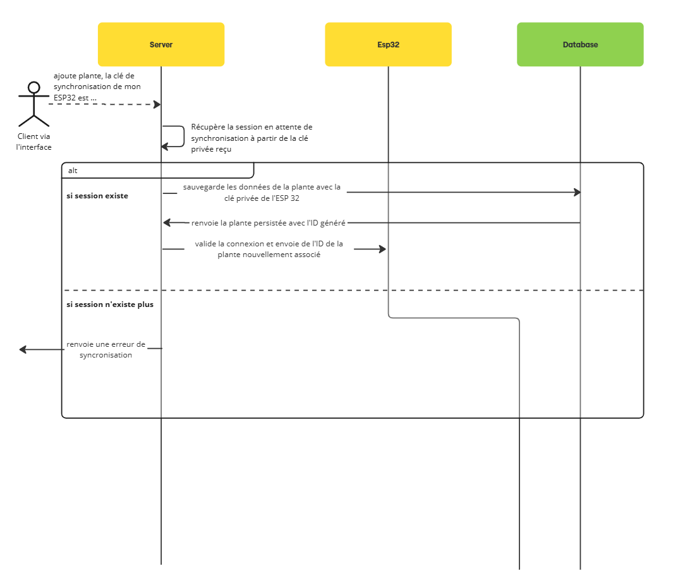
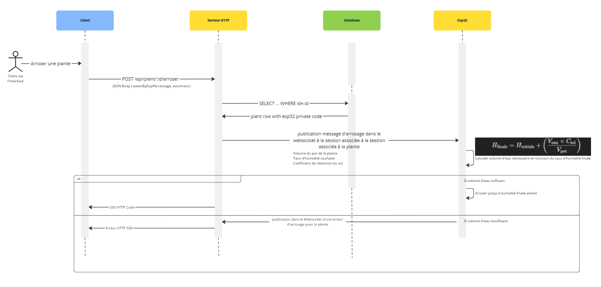
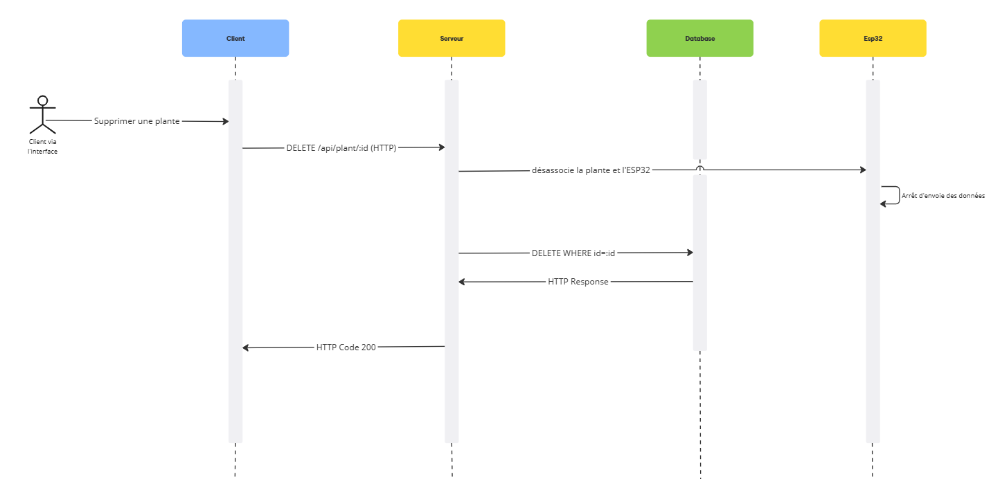
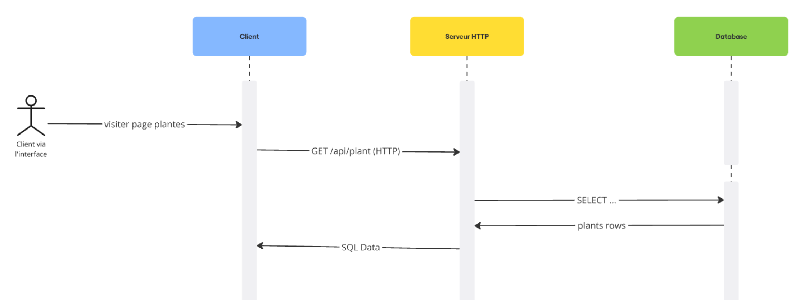

# Introduction

Ce projet a pour but de développer un système d'arrosage automatique. Le but est simple : pouvoir réaliser un suivi des plantes rapidement depuis un site Web.
Les fonctionnalités majeures de ce projet et ce que devra réaliser notre application sera : 

- Consulter la liste des plantes de notre domicile
- Consulter le détail d'un:e plante
- Arroser ses plantes automatiquement
  - en fonction du taux d'humidité
  - en puisant dans une source d'eau
- Arroser ses plantes manuellement 
  - depuis l'interface, sur chaque plante

Pour tout ce qui est arrosage, il y a une vérification du taux de remplissage de la source d'eau pour voir si elle est suffisante

# Phase 1: Conception initiale

Durant la première séance, on a réalisé un brainstorming initial :

La maquette et quelques interactions avec le client

Schéma d'interaction client-serveur initial

## Détail d'une plante

Pour récupérer le détail de plante et les mesures associées, on va tout d'abord récupérer les données de la plante associée
sur la base de données. On récupère également les mesures les plus récentes associées à la plantes.

Comment on a associé les capteurs aux plantes ?

En base de données, on stocke dans une table l'association entre les plantes et les capteurs reliées au pot.

# Conception finale

Durant l'avancée du projet, on a revu un certain nombre de choix qu'on pensait faire au début grâce à l'avancée qu'on faisait via le développement du projet. Voici ci-dessous tous les choix que l'on a fait.

## ESP32 et plantes

Initialement on avait décidé d'avoir un ESP32 pour plusieurs plantes. En pratique, ça s'est avéré trop compliqué et on a décidé d'associer un ESP32 a une plante uniquement avec tous les capteurs relatifs à cette plante

## Communication entre l'ESP32 et le serveur

Pour la communication entre le serveur et l'ESP32, on a finalement décidé d'utiliser une WebSocket. En effet, on a été contraint de choisir un protocole de substitution à HTTP car le serveur doit communiquer en envoyant des paquets réseaux aux ESP32 synchronisés. Le problème auquel on a fait face est qu'HTTP avec TCP/IP, une fois un message envoyé, on ferme la connexion entre l'émetteur et le récepteur. En plus, on s'est dit que l'ESP32 ne pouvait pas être dans le même sous-réseau que le serveur web qui gère un ensemble de clients. Comment le serveur peut-il alors contacter une ESP-32 en ne connaissant pas son adresse IP ?

Pour trouver la solution à ce problème, on a tout de suite pensé à des protocoles orientées "Publish-Subscribre". 

On a hésité entre MQTT et les WebSocket. Par soucis de temps et de montée en compétence, on a décidé de mettre en place la communication via WebSocket même si MQTT est quand même beaucoup plus couramment utilisé dans le monde de l'IOT.

La communication entre un ESP32 et le serveur est donc un canal bi-directionnelle où les 2 entités peuvent publier des messages.

Voici ci-dessous un diagramme de séquence pour montrer la connexion d'un ESP32 au serveur :

L'ESP32 demande au serveur la mise en place d'une communication en WebSocket, la connexion s'établie. L'ESP32 envoie son code privée et le serveur vérifie si l'ESP32 est déjà associée ou non à une plante en vérifiant en base de données si une plante possède cette clé privée. La clé privée peut être l'adresse MAC du microcontrôleur par exemple. Si l'ESP32 est bien associée à une plante, le serveur confirme la connexion et la valide avec l'ID de la plante associée à l'ESP32. L'ESP32 commence alors l'envoie de données (température et humidité de la pièce, humidité de la plante). 

Si l'ESP32 n'est associée à aucune plante, on stocke la session et la clé privée dans une table de demande d'association. La communication est alors en attente tant qu'une plante avec la clé privée envoyée n'est pas ajoutée en base de données.

### Association de l'ESP32 à une plante

## Envoie des données des capteurs d'une plante via l'ESP32

Pour la lecture des données des capteurs, on utilise une tâche sur le noyau FreeRTOS de l'ESP32. On en a une autre pour la gestion de la réception de message et de la pompe.
On reçoit sur le serveur par intervalle régulier les données d'une plante qu'on sauvegarde en base de données.

@startuml
participant ESP32
participant FreeRTOS
participant WebSocket
participant Serveur_SpringBoot
participant DB

FreeRTOS ->> ESP32: Lire les capteurs (airHumidity, airTemperature, soilHumidity)
ESP32 ->> WebSocket: Envoi JSON (plantId, airHumidity, airTemperature, soilHumidity)
WebSocket ->> Serveur_SpringBoot: Réception et désérialisation en un type spécifique
Serveur_SpringBoot ->> DB: Sauvegarde de la mesure
DB -->> Serveur_SpringBoot: Confirmation
@enduml

## Arrosage manuel d'une plante

L'arrosage d'une plante se fait depuis le serveur vers l'ESP32. L'ESP32 est associé à une plante. Lorsque l'utilisateur demande d'arroser tel plante, on reçoit l'ID de la plante que l'utilisateur à demander d'arroser. Avec cette ID, on récupère en base de données la clé privée de l'ESP32 associée à la plante. Dans la liste des sessions ouvertes entre les ESP32 et le serveur, on peut donc retrouver celle qui correspond à la plante en question et sa clé privée. On envoie ensuite un message dans le canal de la WebSocket vers l'ESP32 associée en envoyant les données: le volume du pot de la plante, le taux d'humidité souhaité et le coefficient de rétention du sol. Côté ESP32, le volume d'eau nécessaire et alors calculer en prenant en compte l'humidité courante mesurée via le capteur d'humidité plongée dans la terre.

## Suppression d'une plante

Pour la suppression d'une plante, on envoie à l'ESP32 associé à la plante via le canal de communication un message de désassociation pour l'arrêt de l'envoie de données des capteurs. On la supprime après de la base de données.

## Liste de nos plantes 

Pour la liste de nos plantes, on récupère toutes les plantes de l'utilisateur couramment authentifié. On a une table d'association en SQL entre les utilisateurs et les plantes. On fait donc une jointure entre ces 2 tables, en prenant uniquement les plantes dont l'utilisateur a un ID similaire à celui couramment authentifié.

## Détail d'une plante

Pour le détail d'une de mes plantes, on vérifie que la plante demandée est bien celle de l'utilisateur couramment authentifié. Si oui, on la récupère et on va récupérer les mesures les plus récentes associées à cette plante.

## Authentification

Pour l'authentification, on a décidé de le faire par jeton JWT. Le jeton JWT est généré par le serveur si un utilisateur le demande et que son couple identifiant/mot de passe existe bien en base de données. Ce jeton est ensuite joint à chaque requête afin que le serveur connaisse l'identité du client et sache à quelles données il a accès

@startuml
title Authentification via cryptographie asymétrique

actor Utilisateur
participant Serveur
participant DB

Utilisateur -> Serveur: Envoi identifiant / mot de passe
Serveur -> DB: Vérification de l'existence de l'utilisateur
alt Utilisateur connu
    DB -> Serveur: OK
    Serveur -> Serveur: Génère JWT (valide X temps)
    Serveur -> Utilisateur: Retourne JWT
else Utilisateur inconnu
    DB -> Serveur: Aucun résultat
    Serveur -> Utilisateur: Erreur HTTP
@enduml

# Organisation du projet

|                   Tâches                   |                                                                      Xan                                                                      |                                                 Mathis                                                 |
|:------------------------------------------:|:---------------------------------------------------------------------------------------------------------------------------------------------:|:------------------------------------------------------------------------------------------------------:|
| Mise en place du frontend                  | Initialisation du projet                                                                                                                      |                                                                                                        |
| Mise en place du backend                   |                                                                                                                                               | Initialisation du projet avec Spring Boot initializr                                                   |
| Mise en place de l'objet connecté          | Premiers bouts de programme pour tester les capteurs et la pompe avec Arduino                                                                 | Mise en place d'un code en C++ avec PlatformIO                                                         |
|             Ajout d'une plante             |                                                             Interface utilisateur                                                             |                                                 Backend                                                |
| Synchronisation plante ESP32               |                                                                                                                                               | Réflexion et développement du protocole de synchronisation                                             |
| Communication ESP32 et serveur Spring boot |                                                                                                                                               | Développement du protocole d'échange (WebSocket)                                                       |
|          Récupération d'une plante         |                                                                       X                                                                       |                                                    X                                                   |
| Récupération de la liste des plantes       |                                                                                                                                               |                                                                                                        |
| Modification d'une plante                  | Modification de l'arrosage automatique d'une plante en permettant la modification sur l'interface et en codant la fonctionnalité côté backend | Modification du taux d'humidité souhaité d'une plante frontend/backend                                 |
| Suppression d'une plante                   |                                                                                                                                               | Ajout du bouton côté frontend, suppression côté backend et processus de désynchronisation avec l'ESP32 |
|       Arroser une plante manuellement      |                                                                                                                                               |                       Développement côté backend, envoie de message vers l'ESP32                       |
| Arroser une plante automatiquement         | Développement côté frontend et backend                                                                                                        |                                                                                                        |
| Authentification                           | Formulaire de connexion côté frontend, authentification avec JWT côté back                                                                    |                                                                                                        |
| Création d'un utilisateur                  | Formulaire de création de compte, persistance des données côté back                                                                           |                                                                                                        |